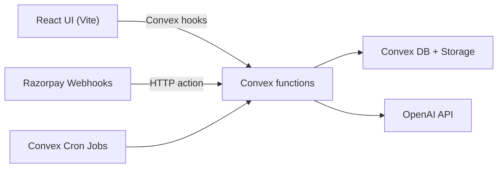

# Developer Maintenance Handbook

This document explains how this codebase is built, how it works, why it works this way, and what to preserve when maintaining it.

Use this as the canonical guide for onboarding, refactors, incident response, and release readiness.

## 1. Product and System Intent

The platform is designed for asynchronous hiring interviews:

- Interviewers create reusable job profiles and question sets.
- Candidates complete interviews through a shared or invite link.
- Video responses are uploaded, finalized, and analyzed by AI.
- Interviewers review candidate performance and billing usage.

The backend is intentionally centralized in Convex so data, auth, scheduling, and business logic remain in one operational surface.

## 2. Stack and Why It Is This Stack

### Frontend

- React 19 + TypeScript
- Vite build/dev server
- Tailwind CSS + Radix-based UI components
- Convex React client for realtime queries/mutations/actions

Why this works:

- React + TypeScript keeps UI predictable as feature complexity grows.
- Vite keeps local feedback loops fast.
- Convex React hooks remove custom client API boilerplate and keep state synced.
- Shared UI primitives reduce visual drift and duplicated behavior.

Why keep it:

- Replacing Convex hooks with custom REST/state layers would add complexity and regress velocity.
- Introducing multiple UI paradigms would create inconsistent interaction patterns.

### Backend

- Convex functions (`query`, `mutation`, `action`, `internalMutation`, `internalAction`, `internalQuery`)
- Convex schema/indexes
- Convex HTTP router + auth HTTP routes
- Convex cron jobs for recurring billing maintenance

Why this works:

- Data model, auth, scheduled jobs, and side effects are colocated.
- Internal functions clearly separate user-facing APIs from backend-only orchestration.
- Schema + index definitions make read patterns explicit.

Why keep it:

- Avoid splitting core logic across multiple backend services unless scale clearly demands it.
- Keep cross-cutting operations (billing, AI orchestration) server-side and internal.

### Integrations

- `@convex-dev/auth` Password provider
- OpenAI for transcription + interview analysis
- Razorpay for payments/subscriptions

Why this works:

- Auth is tightly integrated with Convex identities.
- AI and billing are consumed at backend boundaries where retries and guardrails are enforceable.
- Payment webhooks are verified and deduplicated before state mutation.

Why keep it:

- Auth/token and payment logic should never move to client-side code.
- Keep provider-specific logic isolated to dedicated backend modules.

## 3. Repository Map and Ownership

- `src/`: application frontend.
- `src/App.tsx`: top-level app mode switching (candidate link flow vs authenticated dashboard flow).
- `src/components/Layout.tsx`: shell, nav, responsive menu, user summary.
- `src/components/InterviewerDashboard.tsx`: interviewer workspace and feature entry points.
- `src/components/CandidateInterview.tsx`: candidate interview runtime, permissions, recording/upload/finalization flow.
- `src/components/BillingDashboard.tsx`: billing UX and checkout actions.
- `src/lib/`: frontend utility/context (`DashboardContext`, billing error helpers).
- `convex/schema.ts`: full database contract and indexes.
- `convex/auth.ts`: auth exports + user/password operations.
- `convex/interviews.ts`: interview lifecycle and access checks.
- `convex/responses.ts`: upload/finalization and response persistence.
- `convex/ai.ts`: transcription + analysis pipeline and retry path.
- `convex/billing.ts`: plan, credits, reservations, transactions, and maintenance jobs.
- `convex/billingWebhook.ts`: Razorpay webhook signature verification and event ingestion.
- `convex/hrms.ts`: HRMS API key lifecycle and export queries.
- `convex/hrmsHttp.ts`: bearer-token HTTP endpoints for external HRMS pulls.
- `convex/router.ts` + `convex/http.ts`: HTTP route composition and auth route mounting.
- `convex/crons.ts`: recurring billing maintenance schedules.

## 4. Runtime Architecture

Interpretation:

- UI calls Convex functions directly (no custom API gateway in this repo).
- Convex functions own all writes and privileged operations.
- AI and billing providers are only called from backend actions.

## 5. Data Model and Invariants (Most Important Section)

The schema is built around ownership and lifecycle status transitions.

### Core hiring entities

- `jobProfiles`: created by interviewer (`interviewerId`), contains questions and optional FAQ.
- `interviews`: one candidate run against one profile; owned by interviewer.
- `responses`: per-question response assets and metadata.
- `analyses`: one analysis record per interview.
- `introQuestions`: interviewer-level global questions prepended to each interview.
- `videoChunks`: temporary chunk records during progressive upload.

Invariants:

- Interview data is interviewer-owned; user-facing reads/mutations enforce this.
- Question order may be shuffled per interview but intro questions stay first.
- A response may be legacy single-file or chunked; readers must handle both.

### Billing entities

- `billingAccounts`: current plan and cycle state.
- `creditBuckets`: spendable pools by source (`monthly`, `topup`, etc.).
- `creditReservations`: pre-reserved credits for pipeline and analysis retries.
- `billingTransactions`: immutable ledger-like transaction records.
- `billingWebhookEvents`: idempotency and processing status for incoming webhook events.
- `hrmsApiKeys`: per-interviewer API credentials for external HRMS access.

Invariants:

- Spend is reservation-aware to prevent overspending.
- Charges and releases are reference-based and designed for idempotent retries.
- Webhook events are deduped by `(provider, eventId)` before processing.
- HRMS API keys are stored as hashes and only shown once at creation time.

Why keep these invariants:

- Billing correctness is primarily a consistency problem, not a UI problem.
- Breaking idempotency or reservation semantics can silently corrupt credit balances.

## 6. End-to-End Flows and Why They Are Shaped This Way

### 6.1 Authentication

- Convex Auth handles sign-in/session/token operations.
- `JWT_PRIVATE_KEY` and `JWKS` are required for token signing and discovery.

Why this shape:

- Centralized token lifecycle and Convex identity mapping avoids custom auth glue.

Keep it this way:

- Do not hand-roll session issuance in app code.
- Keep auth HTTP routes mounted via `auth.addHttpRoutes(http)`.

### 6.2 Interview creation and candidate start

- Invite links and public links are both supported.
- Candidate start enforces status and email checks for anti-hijack behavior.
- Pipeline reservation and start charge happen at start.

Why this shape:

- Candidate links are shareable but still guarded against accidental reuse and collisions.
- Upfront reservation prevents in-flight pipeline operations without sufficient credits.

Keep it this way:

- Do not remove candidate/email checks from `startInterview`.
- Keep reservation calls tied to interview lifecycle transitions.

### 6.3 Response upload and finalization

- Supports both:
  - legacy single-file upload (`videoStorageId`)
  - chunked upload (`videoChunkIds`) for better reliability
- Finalization:
  - marks interview completed
  - settles finalize charge
  - schedules AI analysis

Why this shape:

- Chunked upload improves resilience on unstable networks and large recordings.
- Finalization is the right boundary for triggering analysis and billing settlement.

Keep it this way:

- Continue backward compatibility for both storage modes until a full migration is done.
- Preserve cleanup logic for temporary chunk records.

### 6.4 AI analysis pipeline

- Triggered asynchronously through internal actions.
- Transcription and analysis persist outputs back to responses/analyses.
- On failures, reservations are released to prevent stranded credits.

Why this shape:

- AI calls are latency- and failure-prone; async internal orchestration isolates that risk.

Keep it this way:

- Avoid moving AI provider calls to client code.
- Preserve failure compensation paths (reservation release on error).

### 6.5 Billing maintenance and webhooks

- Cron jobs perform cycle resets, topup expiry, stale reservation expiry, and grace enforcement.
- Webhooks are HMAC-verified and deduplicated.

Why this shape:

- Billing has temporal obligations independent of user traffic.
- External webhook delivery is at-least-once; dedupe is mandatory.

Keep it this way:

- Never process payment webhooks without signature validation.
- Keep cron maintenance internal and deterministic.

## 7. Frontend Architecture Decisions to Preserve

### Current view model

- Dashboard navigation is view-state based via `DashboardContext`, not route-based.

Why:

- Single authenticated workspace with fast tab switching and shared local state.

Keep:

- If migrating to route-based navigation, do it intentionally and end-to-end, not partially.

### Candidate runtime resilience

- `CandidateInterview` stores interview continuity in localStorage and handles resume/expiry.
- Permission acquisition is explicit and early.

Why:

- Candidate sessions frequently run on less reliable environments and need recovery behavior.

Keep:

- Preserve resume/validation logic and explicit permission workflows.

## 8. Environment and Configuration

### App/bootstrap

- `CONVEX_DEPLOYMENT`
- `VITE_CONVEX_URL`

### Auth

- `CONVEX_SITE_URL`
- `JWT_PRIVATE_KEY` (PKCS#8 RSA private key, RS256)
- `JWKS` (matching public key set)

### AI

- `OPENAI_API_KEY`

### Billing

- `BILLING_ENFORCEMENT_ENABLED`
- `RAZORPAY_ENABLED`
- `RAZORPAY_KEY_ID`
- `RAZORPAY_KEY_SECRET`
- `RAZORPAY_WEBHOOK_SECRET`
- `RAZORPAY_GROWTH_PLAN_ID`
- `RAZORPAY_CUSTOMER_PORTAL_URL`

Rules:

- Keep local secrets in `.env.local`.
- Set production/staging secrets in Convex deployment env.
- Treat key rotation as an operational procedure, not an ad hoc change.

## 9. Change Management Playbooks

### 9.1 Safe schema changes

1. Add fields as optional where possible.
2. Add required indexes before shipping query code that depends on them.
3. Update all call sites that read/write affected shapes.
4. Validate legacy docs still load.
5. Run `npm run lint`.

### 9.2 Billing changes

1. Preserve transaction reference semantics.
2. Preserve idempotency checks.
3. Ensure all error branches compensate reservations when needed.
4. Validate cycle and expiry jobs against edge timestamps.

### 9.3 Candidate/interview flow changes

1. Keep anti-hijack checks on candidate email and status.
2. Keep resume-safe behavior for in-progress sessions.
3. Preserve cleanup of storage artifacts on deletes.

## 10. Operational Runbooks

### Auth failures

Symptoms:

- Sign-in errors related to JWT signing or PKCS#8 parsing.

Checks:

- Validate `JWT_PRIVATE_KEY` and `JWKS`.
- Validate `CONVEX_SITE_URL`.
- Restart `convex dev` after env changes.

### AI failures

Symptoms:

- Analysis not generated, retries failing, transcription gaps.

Checks:

- `OPENAI_API_KEY` configured correctly.
- `ai.testOpenAIConnection` returns success.
- Interview status is `completed`/`analyzed` for retry path.

### Billing/payment issues

Symptoms:

- Credits not updating, webhook events ignored/failed, subscription state drift.

Checks:

- Billing feature flags and Razorpay credentials.
- Webhook signature secret alignment.
- `billingWebhookEvents` status and event dedupe behavior.

## 11. Release and Maintenance Rhythm

Before every release:

1. `npm run lint`.
2. Validate env var diffs for target deployment.
3. Smoke test:
   - sign in/up
   - create/edit job profile
   - candidate interview start and response submission
   - finalize and analysis
   - billing dashboard and checkout actions (when enabled)

Weekly maintenance:

- Review billing webhook failures.
- Review stale reservation behavior and cron job health.
- Track AI failure/retry rates.

## 12. Anti-Patterns to Avoid

- Moving protected business logic to client components.
- Bypassing ownership checks in Convex mutations.
- Editing billing flow without preserving idempotency/references.
- Removing backward compatibility paths without migration.
- Adding new query patterns without indexes.

## 13. Why You Should Keep This Architecture

Keep it because it optimizes for correctness and shipping speed in this product domain:

- Convex-first backend keeps business logic centralized and testable by flow.
- Ownership and status-based guards prevent accidental data exposure.
- Reservation-based billing prevents subtle credit race conditions.
- Async AI orchestration isolates provider latency/failure from user UX.
- Candidate upload dual-mode support preserves reliability and backward compatibility.

The right way to evolve this system is incremental, preserving invariants while improving ergonomics. Large rewrites should be justified by concrete operational pain, not preference.

## 14. Known Gaps and Next Improvements

- Automated tests are currently limited; add integration coverage around interview + billing pipeline first.
- Add a dedicated admin/support panel for operational workflows.
- Add explicit migration runbooks for any future schema-heavy changes.
